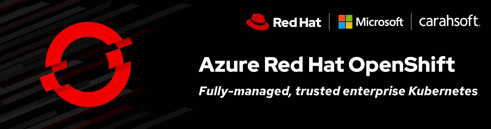
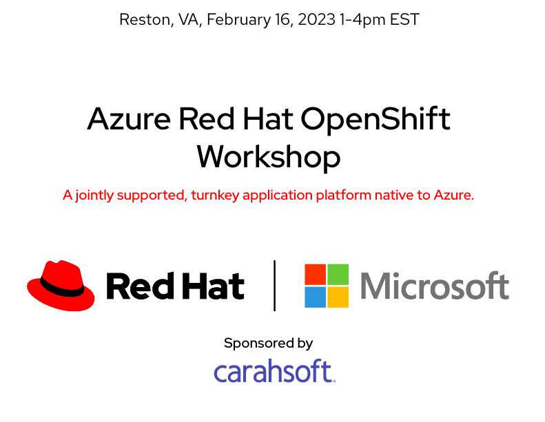

{ align=center }
{ align=center }

## Overview
Join Red Hat® and Microsoft for a hands-on workshop with Azure Red Hat OpenShift® (ARO). During the event, Red Hat Cloud Services experts will guide you through the ARO architecture and answer your questions. The workshop will cover both Operations and Developer activities, and will give the user a feel for how ARO will work for your team and workloads.

**Who should attend:** This in-person workshop is ideal for developers, architects and operations engineers who need a flexible and proven platform to build, deploy and scale applications.

**What to expect:** During the workshop, we will guide you through content to help you understand some of the concepts of deploying container-based applications on Azure Red Hat OpenShift and how to operate an Azure Red Hat OpenShift cluster. We will cover the following:

### Content Overview:

- Complete Day 2 operations tasks such as configuring node and cluster scaling policies, configuring managed upgrades, and using labels for deterministic app placement on nodes
- Learn how to leverage Azure Service Operator to manage and use Azure Services directly from OpenShift
- Deploy an application using CI/CD and expose the application using the Azure Front Door Service
- Use Azure Arc for logging and monitoring of OpenShift and containerized applications

### Development track:

- Deploy an application that uses an Azure Managed Database
- Learn how to use OpenShift Service Mesh for application observability and tracing
- Make an application on OpenShift scalable and resistant to node failures and upgrades

Get experience with, and an informed view of Azure Red Hat OpenShift. Confirm your spot in this workshop, register today to save your seat.

**Prerequisites:** Access to an Azure subscription and Azure Red Hat OpenShift environment which will be provided during the lab. You will receive access at the beginning of the workshop.  Get a personal GitHub account. You can sign up for free [here](https://github.com/signup).

**Registration:** [https://events.redhat.com/profile/form/index.cfm?PKformID=0x688979abcd](https://events.redhat.com/profile/form/index.cfm?PKformID=0x688979abcd)
